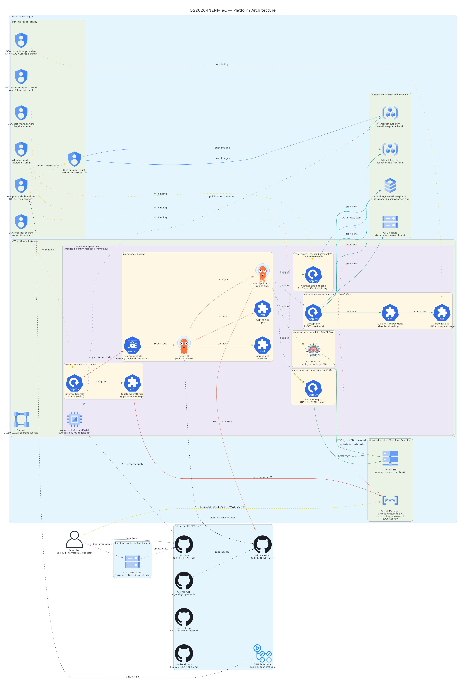
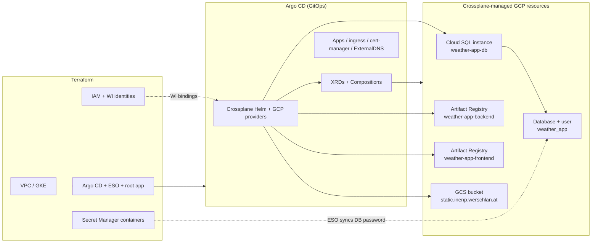

# Platform Architecture

This document describes how infrastructure is provisioned across this repository
(`SS2026-INENP-IaC`), the GitOps repository (`SS2026-INENP-GitOps`), and
Crossplane.

A visual overview is available in the generated diagram:



Regenerate it after changes to `architecture.py`:

```bash
pip install diagrams   # also requires the Graphviz "dot" binary
python docs/architecture.py
```

## Provisioning split

The platform follows a deliberate split:

- **Terraform** bootstraps the cluster, core platform components, IAM identities,
  and permission boundaries.
- **Crossplane** (deployed via Argo CD) provisions selected GCP resources from
  GitOps manifests once it is running inside the cluster.

**Rule of thumb:** if it must exist before Argo CD can sync anything, or it is an
identity/permission boundary, it belongs in Terraform. If it is a GCP resource
that should be managed declaratively alongside app manifests and can be
pruned/recreated by GitOps, it belongs in Crossplane.



## Terraform (`SS2026-INENP-IaC`)

Terraform creates the foundation and wires up permissions. It does **not** create
Cloud SQL instances, Artifact Registry repositories, or the frontend GCS bucket.

### GCP infrastructure

| Resource | File |
| --- | --- |
| VPC + subnet | `vpc.tf` |
| GKE cluster | `cluster.tf` |
| Node pool (`e2-standard-2`) | `node_pool.tf` |
| Node service account | `node_pool.tf` |
| Terraform state bucket (bootstrap) | `bootstrap/state-bucket.tf` |
| API enablement (`secretmanager`, `sqladmin`) | `secret-manager.tf`, `cloud-sql-networking.tf` |

### Kubernetes (directly via Terraform)

| Resource | File |
| --- | --- |
| Argo CD (Helm) | `argo.tf` |
| External Secrets Operator (Helm) | `external-secrets.tf` |
| `ClusterSecretStore` + repo `ExternalSecret`s | `external-secrets.tf` |
| Argo CD `AppProject`s (`platform`, `apps`) | `argocd-project.tf` |
| Root app-of-apps (Helm) | `argocd-root-app.tf` |

### IAM / Workload Identity (identities only)

| Identity | Purpose | File |
| --- | --- | --- |
| `external-secrets` GSA | ESO → Secret Manager | `secret-manager.tf` |
| `cert-manager-dns` GSA | cert-manager DNS-01 | `cert-manager.tf` |
| `crossplane-gar` GSA | Crossplane Artifact Registry provider | `crossplane.tf` |
| `crossplane-sql` GSA | Crossplane Cloud SQL provider | `crossplane-sql.tf` |
| `crossplane-storage` GSA | Crossplane Storage provider | `crossplane-storage.tf` |
| `weather-app-backend` GSA | Backend Cloud SQL Auth Proxy | `backend-cloudsql.tf` |
| `ci-image-push` GSA + WIF pool | GitHub Actions → Artifact Registry | `ci-image-push.tf` |
| ExternalDNS WI principal | DNS record management | `external-dns.tf` |

### Secret Manager (containers + one generated value)

| Secret | How value is set |
| --- | --- |
| `argocd-github-app-*` (3 secrets) | Operator uploads after apply |
| `avwx-api-key` | Operator uploads after apply |
| `cloud-sql-app-password` | Terraform generates and stores |

### Pre-existing / not created by Terraform

- **Cloud DNS managed zone** — must already exist; Terraform only binds IAM to it
  (see [external-dns.md](external-dns.md))
- **GitHub App credentials** and **AVWX token** — uploaded manually after apply

## Crossplane (via Argo CD → `SS2026-INENP-GitOps`)

Crossplane itself is **not** installed by Terraform. Argo CD deploys it from
GitOps:

- `argocd/applications/crossplane.yaml` — Crossplane Helm chart
- `argocd/applications/crossplane-resources.yaml` — manifests under
  `platform/crossplane/`

Terraform only creates the **GCP service accounts and Workload Identity
bindings** that the Crossplane providers use.

### GCP resources Crossplane provisions

| GCP resource | GitOps manifest |
| --- | --- |
| Cloud SQL instance `weather-app-db` | `platform/crossplane/cloud-sql-instance.yaml` |
| Database `weather_app` | `platform/crossplane/cloud-sql-database.yaml` |
| SQL user `weather_app` | `platform/crossplane/cloud-sql-user.yaml` |
| Artifact Registry `weather-app-backend` | `platform/crossplane/artifact-registry-backend.yaml` |
| Artifact Registry `weather-app-frontend` | `platform/crossplane/artifact-registry-frontend.yaml` |
| GCS bucket `static.inenp.werschlan.at` | `platform/crossplane/frontend-hosting.yaml` (`XFrontendHosting`) |

Crossplane also manages its own plumbing: GCP provider installs, `ProviderConfig`s,
XRDs, Compositions, and the patch-and-transform function.

### What Crossplane does not manage

- PostgreSQL **schemas** per tenant (`tenant_a`, etc.) — created by Flyway at app
  startup, documented in `platform/crossplane/schema-multitenancy.yaml`
- Tenant namespaces — discovered by Terraform from `tenants/*/namespace.yaml` in
  GitOps, but the namespaces themselves are created by Argo CD

## GitOps (Argo CD), but not Crossplane

These run on the cluster via Argo CD as plain Helm charts or manifests. They are
not Crossplane-managed GCP resources:

| Component | Argo CD application |
| --- | --- |
| ExternalDNS | `external-dns.yaml` |
| cert-manager + ClusterIssuer | `cert-manager.yaml`, `cert-manager-config.yaml` |
| ingress-nginx | `ingress-nginx.yaml` |
| Kyverno | `kyverno.yaml` |
| Backend / frontend apps | `backend.yaml`, `frontend.yaml` |
| Tenant workloads | `tenants.yaml` |

## Related documentation

- [external-dns.md](external-dns.md) — ExternalDNS Workload Identity and GitOps setup
- [architecture.py](architecture.py) — diagram source (regenerate PNG/SVG after edits)
